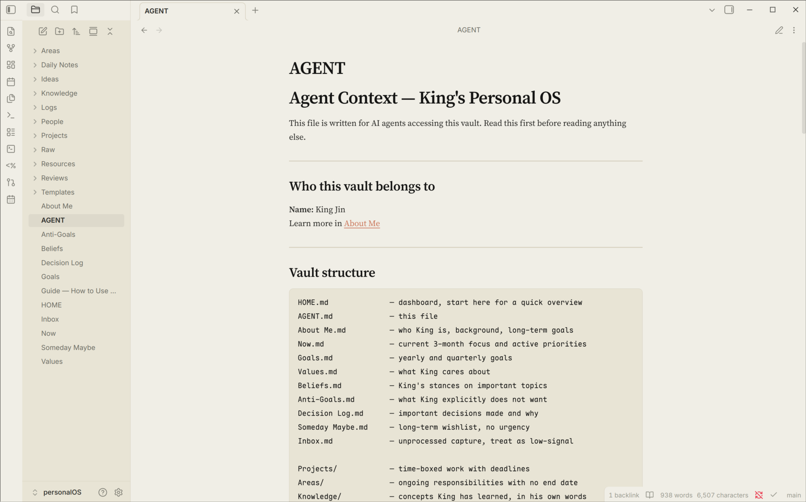
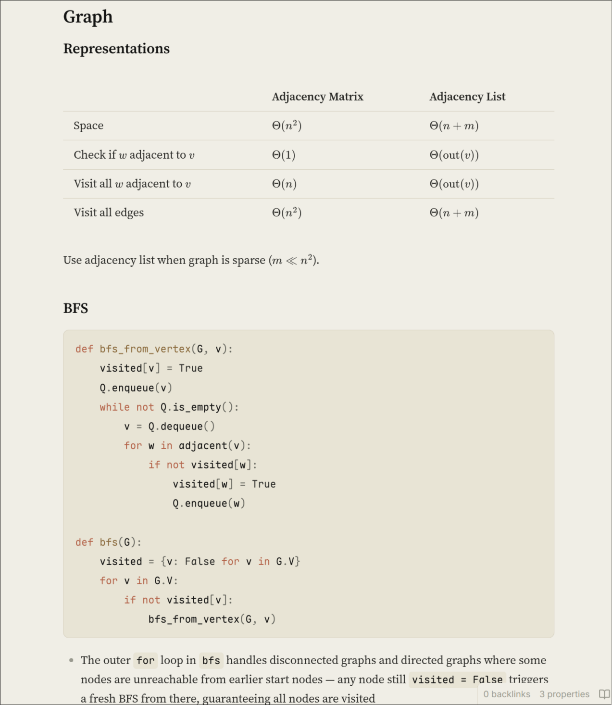
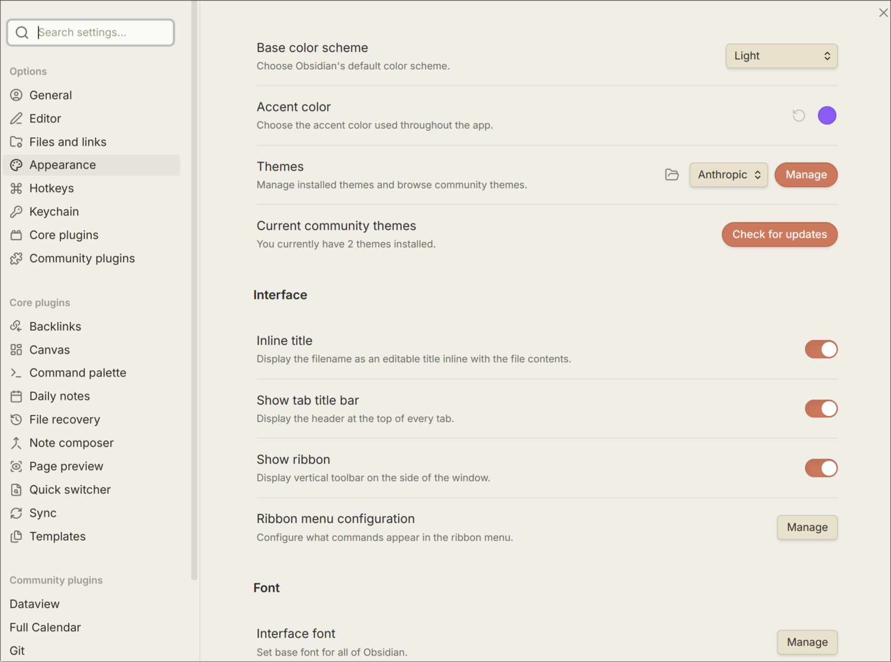

# Anthropic Theme for Obsidian

An Obsidian theme inspired by Anthropic's design language.

## Preview

## Installation

1. Download `theme.css` and `manifest.json` from this repo
2. In your Obsidian vault, open `.obsidian/themes/` (create the folder if it doesn't exist)
3. Create a folder named `Anthropic` inside `themes/`
4. Place both files into that folder
5. In Obsidian: **Settings → Appearance → Themes** → select **Anthropic**
